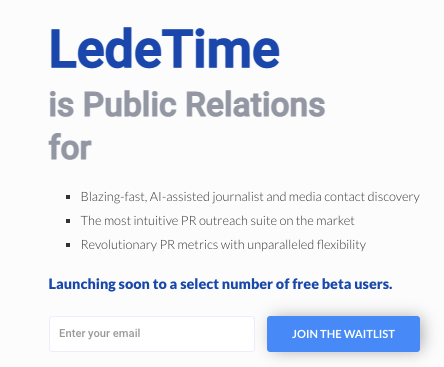

# LedeTime Draft Sites

## Primary Site

This is a working draft of the primary LedeTime marketing site. To avoid hosting costs (for now), I’ve kept this on a Webflow-owned domain, so you’ll see minor things like the `Made in Webflow` badge. You can assume all of this will be removed when porting to `ledetime.com` in the future.

Most of the copy was ported over from our draft Wordpress site and updated, and all of the visual assets were recreated in Figma, so it will be relatively easy to add/remove as needed.

Below is a complete list of currently active pages on this site. I’ve left several other (currently inactive) links in the header and footer menus for now, since these are sections we’d flesh out and complete prior to launch, but there is plenty of the site in place for you to start getting excited now :)

[Homepage](https://lt-testing-space.webflow.io/)

[Features – Media Database](https://lt-testing-space.webflow.io/media-database)

[Features – Pitching and Outreach](https://lt-testing-space.webflow.io/pitching-and-outreach)

[Features – Reporting and Measurement](https://lt-testing-space.webflow.io/reporting-and-measurement)

[Features – Team Collaboration](https://lt-testing-space.webflow.io/team-collaboration)

[Features – More Like This](https://lt-testing-space.webflow.io/ai-content-discovery)

[Features – List Building and Discovery](https://lt-testing-space.webflow.io/list-building-and-discovery)

[Pricing / Plans](https://lt-testing-space.webflow.io/plans)

[LedeTime Blog](https://lt-testing-space.webflow.io/blog)

[LedeTime Blog](https://lt-testing-space.webflow.io/case-studies)

[LedeTime – About Us](https://lt-testing-space.webflow.io/about)

[LedeTime – Contact Us](https://lt-testing-space.webflow.io/contact)

[LedeTime – Trial Sign Up](https://lt-testing-space.webflow.io/sign-up)

## Coming Soon Page

[LedeTime Coming Soon Link](https://ledetime.com/)

PW: CZlK@\*&ix6TdE2zl

**This is already wired to HubSpot and can go up as soon as the OA is done / we want to begin lead capture.**
