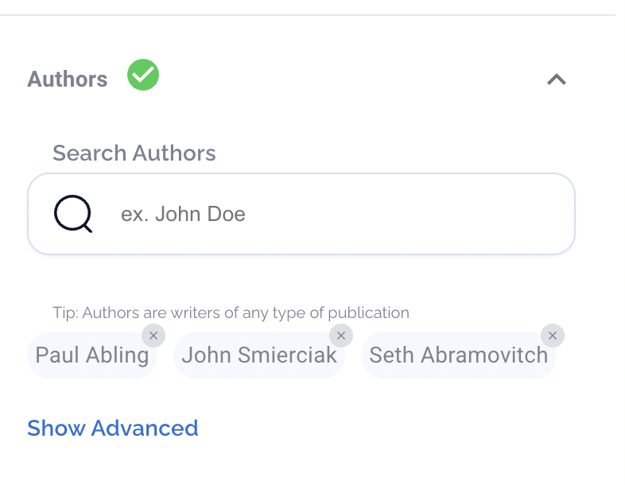

# savedFilter Object Implementation in Campground

## Overview

Advanced Search and Outreach Analytics are two of the most powerful tools within Campground, and we expect both of these to see daily usage by the vast majority of Campground users. As such, we want to build in a quick and easy way for users to save, reload, and modify the complex filter sets they create, rather than needing to reconstruct these filters each time. The goals of this update will be to support that functionality with `savedFilter` objects.

There will be quite a bit of parallel development here with respect to Outreach Analytics and Advanced Search – the backend objects are the same, differing only by their `type`, and much of the functionality between pages will be near identical – so definitely look to abstract things and use generalized components whenever possible.

## Two user stories we should be able to accomplish after this work:

1. "I’m a senior manager with 19 direct reports and 29 active clients. I want to save a filter configuration on Outreach Analytics so I can produce a dashboard showing all the outreach related to my direct reports/clients without having to re-do the setup every time."

2. "I’m a PR professional that regularly pitches stories on finance and cryptocurrency. When I want to find new authors, rather than having to redo my Advanced Searches every time, I want to be able to just load a saved set of conditions that perform this search."

## Deliverables

Let’s work through each of these in order, and we can test extensively at each stage.

1. Ability to save an Advanced Search or Outreach Analytics filter set as a `savedFilter` object. This means saving the large payloads to the database as strings.
2. Management tables for both Advanced Search and Outreach Analytics that support:
   - Changing the name of the filter
   - Deleting the filter
3. Ability to load a saved `savedFilter` object as a usable filter set on both Advanced Search and Outreach Analytics.
   - This will include adding typeahead search sections to the right drawer menu on both Advanced Search and Outreach Analytics.
   - This will also include returning to the management tables and adding functionality such that clicking on the name of the filter and linking directly to the correct page and populating the search.
   - The additional complex element here is you will need to transformed the saved `filter`, which will come in as a string, into a parse-able object that populates the right drawer
4. Correct “save” and “save as” buttons and modals on Advanced Search and Outreach Analytics pages (explained in more detail below) but specifically we need to:
   - Save new filters
   - Update an existing filter
   - Save an existing filter as a new filter
5. A persistence system (likely restricted to just the active session) for a user’s most recent filter set on Advanced Search and Outreach Analytics.

## Designs

### Management Tables

1. [Manage Outreach Analytics Filters](https://kendalljohnson86750.invisionapp.com/console/Fractl-UI-UX-ckiweynuq01r2012wasnd630h/cl12vkg5i09v30121h3u096z9/play)
2. [Edit filter name will match the save new name](https://kendalljohnson86750.invisionapp.com/console/Fractl-UI-UX-ckiweynuq01r2012wasnd630h/cl12v9slb059w01xhe5ec1r9n/play), just replace `Save custom filter` with `Edit filter name`.
3. [Delete a filter from the management table](https://kendalljohnson86750.invisionapp.com/console/Fractl-UI-UX-ckiweynuq01r2012wasnd630h/cl12v9slc059y01xh10ovee6k/play)
   - **Need to create an identical page like this for `Advanced Search` filters**

### Selection/Typeahead elements in right drawer component

**These will be the same for Outreach Analytics and Advanced Search**

1. [Unselected dropdown with Manage Saved Filters text button](https://kendalljohnson86750.invisionapp.com/console/Fractl-UI-UX-ckiweynuq01r2012wasnd630h/cl11h9ksm03cu010j8ehafjo8/play)
2. [Autocomplete Outreach Analytics](https://kendalljohnson86750.invisionapp.com/console/Fractl-UI-UX-ckiweynuq01r2012wasnd630h/cl11h9ksm03cv010j9tz99ehw/play)
3. Note that the savedFilter objects for Advanced Search and Outreach Analytics will each get their own page for CRUD/management

### Button arrangements and modals on results screens - 3 possible situations

1. Results did not come from a loaded filter

   - [Save custom filter button](https://kendalljohnson86750.invisionapp.com/console/Fractl-UI-UX-ckiweynuq01r2012wasnd630h/cl11h9ksl03ct010j56oq6rpe/play)
   - [Save a new filter modal](https://kendalljohnson86750.invisionapp.com/console/Fractl-UI-UX-ckiweynuq01r2012wasnd630h/cl11h9ksm03cw010jd33neddl/play)

2. Results came from a loaded filter that was not modified

   - No new buttons, just giving a button to return to the filter menu

3. Results came from a loaded filter that was then modified
   - [Modify an existing savedFilter object - appears after a search that was loaded from an existing savedFilter object has been executed](https://kendalljohnson86750.invisionapp.com/console/Fractl-UI-UX-ckiweynuq01r2012wasnd630h/cl11h9ksl03cs010j69ai8kgq/play)
   - [Save an existing but updated filter as a new filter modal](https://kendalljohnson86750.invisionapp.com/console/Fractl-UI-UX-ckiweynuq01r2012wasnd630h/cl12vkg5i09v201219oxedbif/play)
   - [Save an existing but updated filter as the same filter modal](https://kendalljohnson86750.invisionapp.com/console/Fractl-UI-UX-ckiweynuq01r2012wasnd630h/cl12vc52p09v10121giwz8sce/play)

## Explanation of CRUD elements for these savedFilter objects

The easiest way to think about what we need to accomplish for saveable filters is to think about how document saving works in an app like Microsoft Word; specifically, I care about the concepts of `Save As` (Create New), `Save` (Update Existing) and `Delete`.

### There are two `Save As` (Create) situations

1. We’re creating a brand new savedFilter object from a filter set the user has created from scratch
2. A user has loaded a savedFilter object, modified it, and now wants to save this new arrangement as a brand new savedFilter object

### There is one `Save` (Update) situation

1. A user has loaded a saved savedFilter object, modified it, and now wants to update the `filter` field of previously-loaded savedFilter object with these new modifications

### There is one `Delete` Situation

1. Users are deleting a saved savedFilter object from a management table.

## Deliverables and Detailed Implementation

Creating a new savedFilter Object
Mutation

`savedFilter` objects are created using

- `accountId`
- a user-provided `name`
- a `type` (which can either be `ADVANCED` or `OUTREACH`)
- a `filter`, which is the full payload to either `ExploreArticles` (for Advanced Search) or `outreachAnalytics` (for Outreach Analytics) converted to a string.

Notes

1. It’s very important to note here that we are just saving this payload as a giant string, not parsing it as a json on the backend. You will later need to use these saved string payloads to repopulate the Advanced Search/ Outreach Analytics search interfaces (meaning that you likely will need to parse them as json objects on the frontend), but when sending/receiving via endpoints the `filter` property should just be a string.

2. (Check w Ryan and Petar on whether we need this now) Also note, Users cannot be allowed to name a new savedFilter object the same as one of their existing ones (we should force them to name it, by default, something like `My Great Search (1)`. This means that before executing this `createsavedFilter` mutation, we’ll need to check against that user’s existing `savedFilter` objects (of the given `type`) to make sure that there is no name match.

Example mutation:

```
mutation($input: CreateSavedFilterInputs!) {
 createSavedFilter(input: $input) {
   id
   name
   type
   filter
 }
}

{
"input":{
"accountId": "xx1",
"name": "My Great Filter",
"type": "ADVANCED",
"filter": "{
   'DateRange': {
     'From': '2022-01-27',
     'To': '2022-03-28'
   },
   'ArticleTitle': {
     'Include': null,
     'Exclude': null
   },
   'ArticleText': {
     'Include': null,
     'Exclude': null
   },
   'Sentiment': null,
   'Authors': {
     'AvgReferringDomains': {
       'Min': null,
       'Max': null
     },
     'TotalTraffic': {
       'Min': null,
       'Max': null
     },
     'TrafficValue': {
       'Min': null,
       'Max': null
     }
   },
   'AuthorInput': [],
   'NumArticles': {
     'Min': null,
     'Max': null
   },
   'Domains': {
     'PrestigeGrade': [],
     'ValueGrade': [],
     'OpenPageRank': {
       'Min': null,
       'Max': null
     },
     'AvgReferringDomains': {
       'Min': null,
       'Max': null
     },
     'TotalTraffic': {
       'Min': null,
       'Max': null
     },
     'TrafficValue': {
       'Min': null,
       'Max': null
     }
   },
   'DomainInput': [],
   'IncludeNodeIDs': [],
   'ExcludeNodeIDs': [],
   'Themes': []
 }
}"
}
}
```

### User Interface

Users have the option to save savedFilter objects once they have executed queries on the Advanced Search/Outreach Analytics pages. The first step for building this functionality is to create the following button arrangement after a search has been completed:

[Save custom filter button arrangement](https://kendalljohnson86750.invisionapp.com/console/Fractl-UI-UX-ckiweynuq01r2012wasnd630h/cl11h9ksl03ct010j56oq6rpe/play)

In this instance, `Customize Filters` returns the user to the right drawer filter menu and `Save Custom Filter` should trigger a [naming modal](https://kendalljohnson86750.invisionapp.com/console/Fractl-UI-UX-ckiweynuq01r2012wasnd630h/cl11h9ksm03cw010jd33neddl/play). Clicking `save` on the naming modal should trigger the `createsavedFilter` mutation.

Later on, we’re going to tackle the more complicated task of loading these saved `savedFilter` objects and parsing their contents into the right side drawers, but for now you’ll need to use Prisma/Apollo studio to make sure this mutation is working (I can also test things at all of your checkpoints).

## Management tables

Before we worry about the more complex elements of loading and updating saved `savedFilter` objects, let’s knock out the basic tables that will be used to manage these saved objects.

### Designs

1. [Manage Outreach Analytics Filters](https://kendalljohnson86750.invisionapp.com/console/Fractl-UI-UX-ckiweynuq01r2012wasnd630h/cl12vkg5i09v30121h3u096z9/play)
2. [Edit filter name will match the save new name](https://kendalljohnson86750.invisionapp.com/console/Fractl-UI-UX-ckiweynuq01r2012wasnd630h/cl12v9slb059w01xhe5ec1r9n/play), just replace `Save custom filter` with `Edit filter name`.
3. [Delete a filter from the management table](https://kendalljohnson86750.invisionapp.com/console/Fractl-UI-UX-ckiweynuq01r2012wasnd630h/cl12v9slc059y01xh10ovee6k/play)

Each type of savedFilter object gets its own page, so the same query is used and the `type` is either `ADVANCED` or `OUTREACH`

```
query($input: UpdateSavedFilterInputs!) {
 savedFilters(input: $input) {
   name
   id
   createdAt
 }
}

{
"input":{
"accountId": "xx1",
"type":"OUTREACH"
}
}
```

The editing option here only allows users to change the name of the savedFilter object (the more complex editing, where a user can change parameters of the search itself, will happen on the primary screens for Advanced Search / Outreach Analytics).

Editing is executed via an update query:

```
mutation($input: UpdateSavedFilterInputs!) {
 updateSavedFilter(input: $input) {
   id
   name
 }
}

{
"input":{
"accountId": "xx1",
"filterId":"4af778cc-3c36-4f74-8f26-7586ac8b2039",
"name":"MY GREAT NEW NAME"
}
}
```

The delete operation looks very much like other delete operations in Campground:

```
mutation($input: DeletesavedFiltersByIdsInputs!) {
 DeletesavedFiltersByIds(input: $input) {
   deleted
 }
}

{
"input":{
"accountId": "xx1",
"ids":["4af778cc-3c36-4f74-8f26-7586ac8b2039"]
}
}
```

Finally, note that we will circle back to these tables later to add a feature where clicking on the name will take a user to the correct page and use `savedFilter` to populate a filter set.

## Loading saved savedFilter objects

### The basics

Users find their saved searches via a new row we’re adding to the right drawer element on both Advanced Search and Outreach Analytics. Designs will be identical for the two pages and can be seen below:
[Unselected dropdown with Manage Saved Filters text button](https://kendalljohnson86750.invisionapp.com/console/Fractl-UI-UX-ckiweynuq01r2012wasnd630h/cl11h9ksm03cu010j8ehafjo8/play)
[Autocomplete Outreach Analytics](https://kendalljohnson86750.invisionapp.com/console/Fractl-UI-UX-ckiweynuq01r2012wasnd630h/cl11h9ksm03cv010j9tz99ehw/play)

The autocomplete query is as follows:

```
query($type: String!, $accountId: String!, $query: String!) {
 AutoCompleteSavedFilter(type: $type, accountId: $accountId, query: $query) {
   Name
   UUID
   Type
   Search
 }
}

{
"query": "some search term",
"accountId": "xx1",
"type": "ADVANCED"
}
```

The `Manage saved filters` button should go to the appropriate management table.

### Populating the filter panel with objects from a saved search

**The final deliverable for this section is that a user would see a saved search populate into the right drawer panel and would be able to execute that search**

This will be one of the more complex undertakings of this update, and will be basically entirely frontend work. In a nutshell, you need to take the saved `filter` field from the User’s selection from `AutoCompletesavedFilter`, parse it, and then populate the search panel in such a way that the user is able to execute the query (either `ExploreArticles` or `outreachAnalytics`) with a payload that has been loaded in from the selected savedFilter object.

In many cases, you will need to use the UUID to run some supplemental queries in order to show the names in the UI.
Those fields are:

- Advanced Search
  - AuthorInput - feed to `Authors` query
  - DomainInput - feed to `Domains` query
  - IncludeNodeIds - feed to `Keywords`, `Entities`, and `Topics` queries
  - ExcludeNodeIds - feed to `Keywords`, `Entities`, and `Topics` queries
  - All other Advanced Search fields are string or numeric input and you should be able to plug those values in
- Outreach Analytics
  - All fields require supplemental queries to get names

Example: A `filter` field may contain several ID’s in the `'AuthorInput'` array, so you would need to execute an `Authors` query to get the names associated with these Ids and display them in the panel like so:



## The ‘Save’ and ‘Save As’ Aspect of savedFilter Objects: Handling Creating and Updating savedFilter objects when a saved object has been loaded

Once you are able to load in saved savedFilter objects to run searches, we need to handle the button logic in the UI and the corresponding logic for either saving new savedFilter objects or updating the `filter` property on existing savedFilter objects. You should already have the simplest form of this logic from the first deliverable, [which allows a user to save a new savedFilter object after results have been rendered](https://kendalljohnson86750.invisionapp.com/console/Fractl-UI-UX-ckiweynuq01r2012wasnd630h/cl11h9ksl03ct010j56oq6rpe/play)

Now we need to add in the two scenarios pertaining to when user’s have searched with a saved userObject, rather than having just created a new filter set.

1. If the user loaded in a saved savedFilter object but didn’t change anything, then we should not show any save buttons.
2. If the user loaded in a saved savedFilter object but **did change something**, we need to give them the option of either saving this as a new filter or updating their existing filter. So when we render results, they should see buttons consistent with [this mockup](https://kendalljohnson86750.invisionapp.com/console/Fractl-UI-UX-ckiweynuq01r2012wasnd630h/cl11h9ksl03cs010j69ai8kgq/play)
3. Note that navigating away from the page will simply do nothing (meaning it will essentially get rid of the user’s most recent updates).


### If a user selects update existing filter:

[Design for modal here](https://kendalljohnson86750.invisionapp.com/console/Fractl-UI-UX-ckiweynuq01r2012wasnd630h/cl12vc52p09v10121giwz8sce/play)

Execute the update mutation:

```
mutation($input: UpdateSavedFilterInputs!) {
updateSavedFilter(input: $input) {
  id
  filter
}
}

{
"input":{
"accountId": "xx1",
"filterId":"d132ad87-03b0-4663-a0f0-7c9bcc2c63e1",
"filter":"{THE NEW JSON STRING OF THE ENTIRE FILTER}"
}
}
```

### If the user selects `Save As New Filter`:

[Design for new modal herel](https://kendalljohnson86750.invisionapp.com/console/Fractl-UI-UX-ckiweynuq01r2012wasnd630h/cl12vkg5i09v201219oxedbif/play)

Use the create mutation, validating that the name they’ve entered does not match an existing savedFilter object with the same type (by checking the input name against the names returned by the `savedFilters` query).

```
mutation($input: CreateSavedFilterInputs!) {
 createSavedFilter(input: $input) {
   id
   name
   type
   filter
 }
}

{
"input":{
"accountId": "xx1",
"name": "My Great Search",
"type": "ADVANCED",
"filter": "{THE JSON STRING OF THE ENTIRE FILTER}"
}
}
```

## Persisting a user’s most recent configurations for Advanced Search and Outreach Analytics

This is the area where I have the least knowledge of the technical aspect, but we should persist a user’s most recent configurations for both Advanced Search and Outreach Analytics during a given session.

From a user story perspective, this should look like:

- "I create an advanced search or outreach analytics filter set in the right drawer menu, click away from the page/do other things in the app, and then when I return to the Advanced Search / Outreach Analytics page, my previous search configuration is still present in the right side drawer."
- [Question for Ryan/Petar: How to handle if the previous was a saved userObject]
